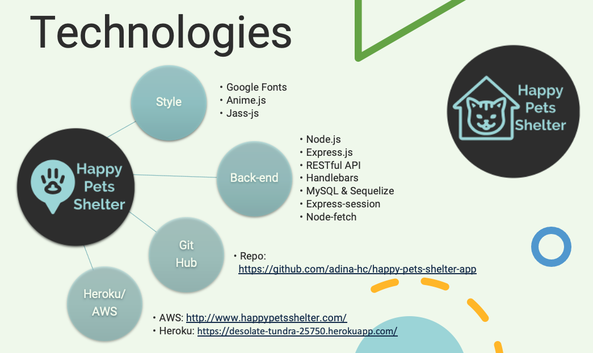

# Happy Pets Shelter App

## Description

A veterinarian as the owner of a pet shelter, would like to help rescuers with abandoned or found pets where:

- Pets rescued and sheltered can be visible to families for future fostering or adoption

- Rescuers can select from the listed pets their own future family member

So that happy pets have happy owners based on matched pets and rescuers

## Current Features

* Navigator:
    * Home section to view pet categories
    * Login for existing users to access with user id and encrypted password
    * Admin access for shelter personnel:
        - Form displays to enter pet information

* Home or landing page:
    On-click of pet categories, forms display:
    - Login -> existing users
    - Signup -> new users to create user id, password and user provides name and last name

* Once logged in:
    - Logout section appears in the navigator to terminate de session, replacing the Login section
    - On-click of specific pet, detail info displays
 


## Acceptance Criteria
```md
WHEN the user accesses the Happy Pets Shelter app
THEN a navigation bar show 'Home', 'Login', 'Admin' sections
AND the homepage displays pictures of pet categories for adoption

WHEN the user clicks on a picture,
THEN two forms display to either Login or Signup
```
*NEW USER*
```md
WHEN the new user signs up by providing their user name and password with name and lastname
```
*EXISTING USER*
```md
WHEN the existing user logs in with user id and password
```
*BOTH NEW AND EXISTING USERS*
```md
THEN the user is redirected to view pet categories
WHEN the user selects a pet category
THEN that category displays pets for adoption
WHEN user clicks on specific pet,
THEN pet information displays for the selected pet
```

***ADMIN***
```md
WHEN admin -shelter personnel- clicks on 'Admin' section on navbar
THEN a Pets form is displayed to enter pet details to store in the database
```


---------------------------------------------------

## Resources



## Wireframing


---------------------------------------------------

## Mockup

### App Functionality

New or existing user


____________________________________________________
## Future Criteria
```md
WHEN the user selects the pet from a category
THEN the pet information displays
AND the user is presented with a button to adopt the pet
WHEN the button is clicked, the adoption request triggers a change of status from 'Shelter' to 'Rescued'
```

### Future Features
* User has access only to select from a bank of pet images
* Admin has views to assign pet to adopter/user
* User will be redirected to sign up if no log in information exists or if it is incorrect
* User can adopt on a click of a button

## License
```md


```